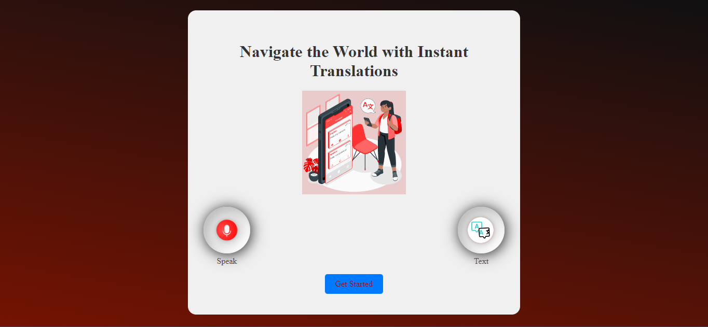

# Online Translation App

## Overview

The **Online Translation App** is a modern web application offering both **voice** and **text translation** features. It includes a neumorphic design and real-time translation capabilities, built using HTML, CSS, and JavaScript. The app supports multiple languages and features interactive elements for a seamless user experience.

## Features

- **Voice Translation:** Record your voice and get translations in real-time.
- **Text Translation:** Input text and get translations instantly.
- **Neumorphic UI Design:** Stylish and modern button design for a better user experience.
- **Responsive Design:** Fully functional across all devices and screen sizes.
- **Language Switching:** Easily swap between source and target languages.
- **History Management:** Store, view, clear, and download translation history.
- **Speech Synthesis & Recognition:** Listen to translations and use voice input for translations.
- **Waveform Animation:** Visual representation of speech input with real-time waveform animation.

## Technologies Used

- **HTML5**: Structure and layout of the application.
- **CSS3**: Styling with neumorphic design elements and responsive features.
- **JavaScript**: Interactive elements, real-time translation, and API integration.

## Pages

### 1. Home Page
Navigate through the app’s features with links to the **Voice Translator** and **Text Translator** pages. Includes interactive neumorphic buttons.

### 2. Voice Translator
- Record your voice for real-time translation.
- Features waveform animation to visualize speech input.
- Utilizes the Web Speech API for speech recognition and synthesis.

### 3. Text Translator
- Manually input text and select source and target languages for translation.
- Instant translation with options to copy or share the translated text.

## JavaScript Functionality

### Language Options and Dropdowns
- **Populating Language Dropdowns:** Populate source and target language dropdowns dynamically.
- **Language Switching:** Swap source and target languages with a click event.

### Real-time Translation
- **MyMemory Translation API:** Fetch translations and update the UI in real-time.
- **Text Input Event:** Translate text as it is entered and store history.

### Speech Synthesis & Recognition
- **Speech Recognition:** Record and transcribe voice input, translating it in real-time.
- **Speech Synthesis:** Read out translated text using the Web Speech API.
- **Waveform Animation:** Visualize speech input with a dynamic waveform.

### History Management
- **Store History:** Save translation history with a delay.
- **Display History:** Show translation history in a modal with options to save, delete, clear, and download.
- **Download History:** Export translation history as a text file.

## Future Enhancements
- Expand language options for broader translation support.
- Implement additional features for accessibility and user customization.
- Optimize performance and UI responsiveness for better user experience.
